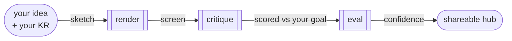
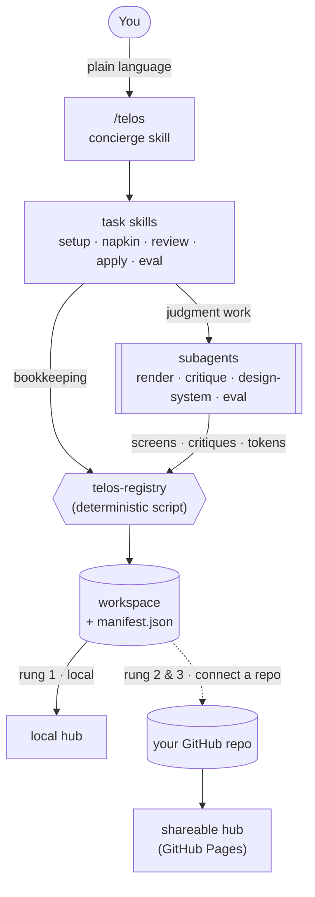
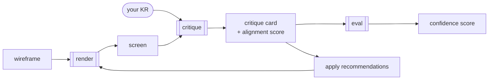

<div align="center">

# Telos

**The PM toolkit where every screen is tied to a business goal.**

*Design tools think in pixels. Analytics tools think in numbers.
Nobody checks whether a design actually serves the goal — before you ship it.
That's Telos.*

</div>

---

## The gap Telos fills

Every design tool stops at *"does it look good?"* Telos asks the question PMs actually care about: **"does this screen serve the goal you're trying to hit?"**

You give it your screens and a **KR** (a Key Result — the number you're trying to move, like *"increase 7-day retention"* or *"lift checkout conversion"*). Telos critiques the whole flow against that goal — not generic UX heuristics — and hands you a clean, shareable critique you can drop in Slack, Jira, or a leadership review.

It runs entirely inside Claude Code. No new vendor to get past security. No Figma seat. No data leaves your machine unless you decide to share it.

**In one picture** — you bring an idea and a goal; the agents hand each other the work and you get a shareable, goal-scored hub:



## Install

```
/plugin marketplace add ProductVoyagers/telos
/plugin install telos
```

Then just talk to it:

```
/telos
```

Telos figures out what you need and walks you through it. Or jump straight to a command:

| Command | What it does |
|---|---|
| **`/telos`** | The front door. Describe what you want — "sketch a checkout screen", "is this flow good for retention?" — and Telos routes the rest. |
| **`/telos-setup`** | One-time setup. Learns your product's design system from 3-5 screenshots; optionally connects a GitHub repo. |
| **`/telos-napkin`** | Turns a wireframe (or a Figma frame) into a styled phone-frame screen *in your design system*. |
| **`/telos-review`** | Critiques a flow against one or more KRs. Produces a critique card + a side-by-side review board. |
| **`/telos-apply`** | Accepts critique recommendations and regenerates the affected screens as new versions. |
| **`/telos-eval`** | Scores a critique's own quality across six dimensions — so you know how much to trust it before you share it. |

## What a critique looks like

Every review is anchored to your KR and reads like a sharp PM wrote it, not a linter:

- **KR alignment** — a 1-5 score for how well the flow serves the goal
- **What serves the KR** — the design choices that already help, tied to specific screens
- **What to reconsider** — ranked by impact (HIGH / MEDIUM), each connected back to the goal
- **Suggestions** — specific, numbered, actionable changes you can apply with one command
- **Sub-metric tags** — which lever each point moves (Retention, Engagement, Conversion, Activation…)

And because AI output needs to earn trust before it goes to leadership, `/telos-eval` scores the *critique itself* — KR relevance, blind-spot detection, actionability, and more — and shows a confidence badge.

## How it grows with you

1. **Solo, local.** Works the moment you install it. No GitHub, no ceremony. Everything stays on your machine, viewable as a local hub.
2. **Solo, connected.** Point Telos at your own GitHub repo whenever you decide. Your flows render as a shareable web hub on GitHub Pages.
3. **Squad.** Point a whole team at one repo. Versioned screens, threaded comments on each critique, and a shared, goal-annotated hub. Telos becomes your Figma — but for goals, not just pixels.

You opt into each rung when *you're* ready. Nothing pushes anywhere until you connect a repo.

## Connecting to GitHub (optional)

Telos is **local-first** — it works fully on your machine with no GitHub at all. "Connecting" just means pointing Telos at **a GitHub repo you own** so two things become possible: your hub turns into a **live, shareable website**, and a **squad can collaborate** in one place. You can stay local forever, or connect whenever you want by re-running `/telos-setup`.

When you connect, here's exactly what happens:

1. **You create an empty GitHub repo** — e.g. `my-telos-flows`. (Make it *public* if you want the hub to be publicly viewable.)
2. **Run `/telos-setup`** and choose "connect"; paste your repo's URL.
3. Telos **clones it to your machine** and uses it as your workspace. From then on, every screen and critique you make is **committed and pushed to that repo automatically** — you never run git yourself.
4. **Turn on GitHub Pages** for the repo (Settings → Pages → Branch: `main`). Your hub is now live at your Pages URL — share it in Slack, a doc, or a stakeholder review.

**What lands in the repo:** your flows, screens, critiques, the manifest, and the hub pages — all in *your* repo, under your control. Nothing is sent anywhere else.

**For a squad:** each teammate creates their `~/.telos` config pointing at the **same** repo. Everyone's screens and critiques land in one shared hub, attributed to whoever made them, with versioned screens and threaded comments. That's the "Telos as your team's Figma" rung.

## Under the hood

You talk to one concierge. It routes to task skills, which split the work two ways — **judgment goes to subagents, mechanics go to a script** — and everything lands in a workspace you own:



And the core loop — sketch a screen, critique it against the goal, improve it:



- **You talk to a concierge skill** (`/telos`) running in your main Claude session — it understands intent and orchestrates the rest.
- **Specialist subagents** do the focused work in isolation: rendering screens, critiquing against KRs, extracting your design system, scoring critique quality.
- **A deterministic registry script** handles the bookkeeping — manifest, walkthrough generation, and git sync — so a language model never hand-edits your files or your repo.
- **One config file** (`~/.telos/config.json`) holds your identity, design system, and (optional) repo. Everything reads from it.

## Privacy

Telos runs locally in Claude Code. Your screens, KRs, and design system never leave your machine unless *you* connect a repo and push them there. Your GitHub stays yours; Telos just writes to the repo you point it at.

> **Using Telos for work at a company?** Stay in **local mode**, or connect a **private** repo — never push proprietary designs to a public one. Telos is local-first precisely so your employer's work never leaves your machine unless you deliberately send it somewhere, and for company work that somewhere should be private. No new vendor, no data leaving your laptop, nothing for IT/security to approve.

## License & credit

Licensed under the **Apache License 2.0** — see [LICENSE](LICENSE) and [NOTICE](NOTICE). Use it, fork it, build on it; just keep the attribution.

**Created by [ProductVoyagers](https://github.com/ProductVoyagers).** Telos — the approach of critiquing design against business goals, and this implementation — originated here. If you build on it, the NOTICE keeps the credit with it.

---

<div align="center">

Created by **[ProductVoyagers](https://www.productvoyagers.com)** · for PMs building with AI

Telos is part of **ProductVoyagers** — the reads, ideas, and tools for the AI-native PM.
Read the essays at **[productvoyagers.com](https://www.productvoyagers.com)** · code at **[GitHub](https://github.com/ProductVoyagers)**

</div>
